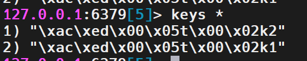
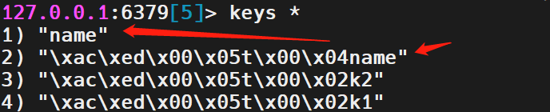

# SpringDataRedis 
### 使用步骤
- 引入 spring-boot-starter-data-redis 依赖
- 在 application.yml 文件配置 Redis 信息
- 注入 RedisTemplate
不同操作
- ops 看返回值类型即可

### 序列化
RedisTemplate 默认序列化
```java
    void testString() {
        // set (obj,obj) 底层自动序列化
        redisTemplate.opsForValue().set("k2","v1");

        System.out.println(redisTemplate.opsForValue().get("k1"));

    }
```
存入之后变为这个



默认的 JDK 序列化方式有以下缺点
* 可读性较差
* 内存占用较大

改变 RedisTemplate 的 Serializer 序列化器 不必去记怎么去写，用的时候当网上找即可。

```java
import com.fasterxml.jackson.annotation.JsonAutoDetect;
import com.fasterxml.jackson.annotation.PropertyAccessor;
import com.fasterxml.jackson.databind.ObjectMapper;
import org.springframework.context.annotation.Bean;
import org.springframework.context.annotation.Configuration;
import org.springframework.data.redis.connection.RedisConnectionFactory;
import org.springframework.data.redis.core.RedisTemplate;
import org.springframework.data.redis.serializer.Jackson2JsonRedisSerializer;
import org.springframework.data.redis.serializer.StringRedisSerializer;

@Configuration
public class RedisConfig {

    //编写我们自己的配置redisTemplate
    @Bean
    @SuppressWarnings("all")
    public RedisTemplate<String, Object> redisTemplate(RedisConnectionFactory redisConnectionFactory) {
        RedisTemplate<String, Object> template = new RedisTemplate<>();
        template.setConnectionFactory(redisConnectionFactory);

        // JSON序列化配置
        Jackson2JsonRedisSerializer jsonRedisSerializer=new Jackson2JsonRedisSerializer(Object.class);
        ObjectMapper objectMapper=new ObjectMapper();
        objectMapper.setVisibility(PropertyAccessor.ALL, JsonAutoDetect.Visibility.ANY);
        objectMapper.enableDefaultTyping(ObjectMapper.DefaultTyping.NON_FINAL);
        jsonRedisSerializer.setObjectMapper(objectMapper);

        // String的序列化
        StringRedisSerializer stringRedisSerializer=new StringRedisSerializer();

        //key和hash的key都采用String的序列化方式
        template.setKeySerializer(stringRedisSerializer);
        template.setHashKeySerializer(stringRedisSerializer);

        //value和hash的value都采用jackson的序列化方式
        template.setValueSerializer(jsonRedisSerializer);
        template.setHashValueSerializer(jsonRedisSerializer);

        template.afterPropertiesSet();

        return template;
    }
}
```

